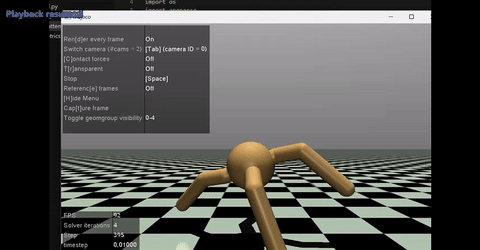

# Quadruped Ant-v4 Environment Training with Stable-Baselines3

This project focuses on training the Ant-v4 quadruped environment in MuJoCo using several reinforcement learning algorithms provided by Stable-Baselines3. The algorithms used in this repository are:

- Deep Deterministic Policy Gradient (DDPG)
- Soft Actor-Critic (SAC)
- Twin Delayed Deep Deterministic Policy Gradient (TD3)
- Proximal Policy Optimization (PPO)
- Advantage Actor-Critic (A2C)

## System Specifications

- **Python Version**: 3.7.10
- **Stable-Baselines3 Version**: 1.5.1a8
- **PyTorch Version**: 1.11.0
- **GPU Enabled**: True
- **Numpy Version**: 1.21.2
- **Gym Version**: 0.21.0

The repository includes the training scripts, model definitions, and environment configurations required to implement the algorithms listed above. The Ant-v4 environment is used to simulate the movement and control of a quadruped robot in a MuJoCo simulation environment.

## Results

### Training Progress (Ant-v4)
 
